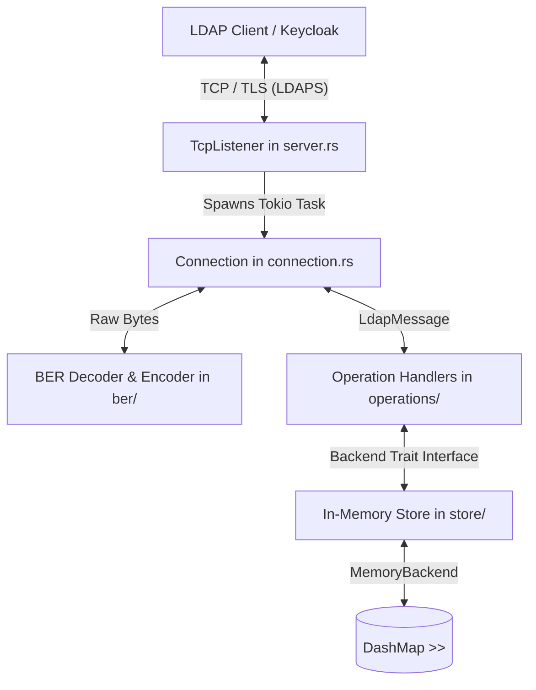

# FastLDAP

FastLDAP is an asynchronous, high-performance, in-memory LDAP (Lightweight Directory Access Protocol) server built with Rust and tokio async runtime for managing TCP and TLS connections, the nom parser-combinator library for decoding Basic Encoding Rules (BER), and a lock-free concurrent hash map combined with fine-grained locking to implement an in-memory directory store. Designed for speed, safety, and RFC 4511 compliance, this solution serves as a highly scalable identity provider. It is a good candidate for Keycloak federation.

## Features

- **Asynchronous I/O**: Fully built on `tokio` for maximum concurrency.
- **Zero-Copy Parsing**: Utilizes `nom` and `bytes` for streaming BER decoding and encoding.
- **Lock-Free Concurrency**: Uses `DashMap` to provide a blazingly fast in-memory store.
- **LDIF Bootstrapping**: Built-in LDIF parser to quickly seed users and groups at startup.
- **Security Ready**: Built-in support for LDAPS (TLS over port 636) using `tokio-rustls`.
- **Search Capabilities**: Supports complex RFC 4515 LDAP search filters for group and user enumeration.

## Prerequisites

- **Rust Toolchain**: 1.75 or higher.
- **C++ Build Tools**: Required for compiling procedural macros on Windows. Ensure you have the Visual Studio Build Tools with C++ extensions installed.

## Building and Running

1. **Build the project**:
   ```bash
   cargo build --release
   ```

2. **Run the server**:
   ```bash
   cargo run --release
   ```
   By default, the server will load seed data from the `initial_ldif` configuration and bind to port `3893` to accept LDAP connections.

## Project Structure

- `src/ber/`: Zero-copy BER streaming decoder and encoder.
- `src/protocol/`: LDAP message structures and response codes.
- `src/store/`: `DashMap`-backed in-memory store and LDIF loader.
- `src/operations/`: Request handlers for Bind, Search, etc.
- `src/filter/`: RFC 4515 compliant filter parser and evaluator.
- `src/server.rs` & `src/connection.rs`: Tokio TCP/TLS connection management.

## System Architecture



## Component Interaction

- **Network & Connection Layer**: Handles incoming TCP connections and TLS wrapper streams inside `server.rs` and delegates them to `connection.rs`. This spawns a dedicated Tokio task per client connection. Connection streams read data into a buffer.

- **ASN.1 BER Encoding**: Managed by the `ber/` module, which decodes raw bytes into primitive types (like integers and strings) and handles serialization of LDAP message responses. Basic Encoding Rules (BER) is used by LDAP protocol payloads. It decodes ASN.1 primitive types (integers, booleans, strings) and tags/lengths using nom for zero-copy parsing.

- **Protocol Layer**: `protocol/` defines the LDAP message structures and response codes for each operation (Bind, Search, Add, Delete, Modify, ModifyDN) and result codes defined in RFC 4511.

- **Database Backend**: Under `store/`, models the database layer, directory entries, storage backend interfaces, and LDIF data seeding utility. It uses a concurrent `DashMap`to manage entries thread-safely with high read throughput.

- **Operation Controllers**: The `operations/` module coordinates request payloads with backend storage mutations and generates response structures. Translates LDAP requests to store calls (e.g. matching passwords for Binds, evaluating entries for Searches).

- **Search Filters**: The `filter/` module parses LDAP RFC 4515 filter string expressions into a structured Abstract Syntax Tree (AST) and evaluates them against directory entries. Supports complex filter operations including logical logic (`&`, `|`, `!`, `*`, etc), attribute existence checks (`(cn=*)`), and substring matching.


## Keycloak Integration

FastLDAP is specifically designed to handle Keycloak's User Federation. 
To connect Keycloak:
1. Navigate to Keycloak Admin Console -> User Federation -> Add LDAP.
2. Set **Vendor** to `Other`.
3. Set **Connection URL** to `ldap://127.0.0.1:3893` (or `ldaps://...`).
4. Set **Users DN** to `dc=example,dc=com` (matching the seed data).
5. Set **Bind Type** to `simple`.
6. Configure the Bind DN and password to match your administrative account.

## Future Roadmap

- [x] Support for LDAP Add, Delete, Modify, and ModifyDN operations.
- [ ] Persistent storage backends (e.g., RocksDB).
- [ ] Advanced SASL authentication (GSSAPI, SCRAM).
- [ ] Strict LDAP schema validation.

## License

This project is licensed under the MIT License.
